# Magnetic-Levitation-System-Control
 
Magnetic levitation enables gravity defying by applying magnetic fields to suspend objects in mid-air. This occurs as the magnetic force generated counteracts gravity, resulting in the object's suspension. An application of this is evident in Maglev trains, which glide almost frictionlessly above the track surface due to the absence of physical contact. Consequently, these trains can attain remarkable speeds. The operational mechanism involves altering the magnetic polarity along the rails to propel the train forward or backward.
 
 

__System Description__:
 
In the system below, there is a coil around the magnetic core and an iron ball. By applying a voltage to the coil and passing current, It attracts an iron ball from it. The purpose of this system is to control the height of the iron ball by the input voltage. In this system, y distance of the iron ball from the magnetic core, V  is the applied voltage to the system and I is the circuit current.

 

 
Here is the equations describing the system:
 

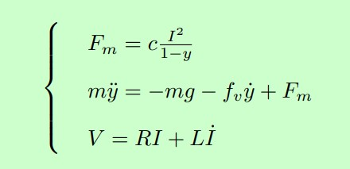

 
After finding the equilibrium point of the system and linearizing the system around that point, we calculate the state matrices:
 
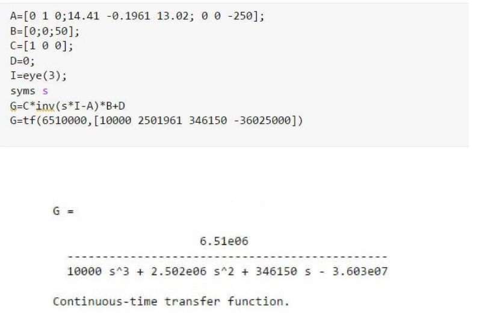
 
 

__Controller__:
 
We design an analog PID controller for the system:
 
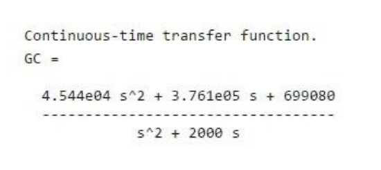
 
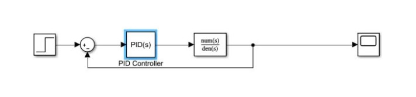
 
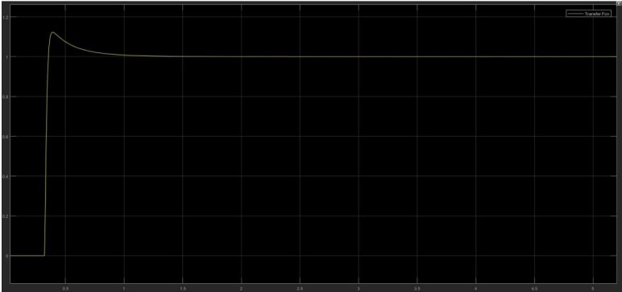
 
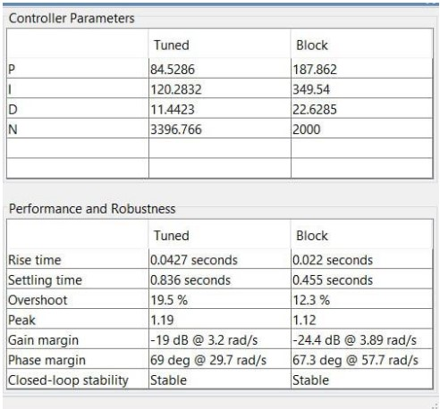
 
 
Then we xheck the controller performance in the non-linear system.
 
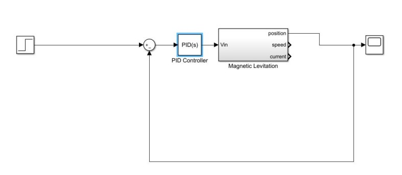
 
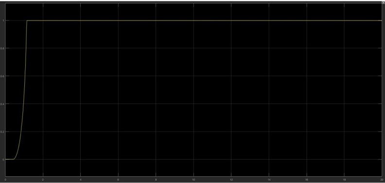
 
 

__Feedback Controller__:
 
We use pole placement to design a feedback controller. We set 2 sets o

 
 

# System Discretization:

 
Now we discretize the system
 

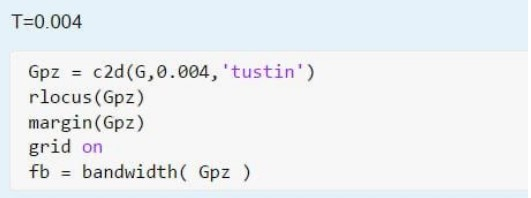

 

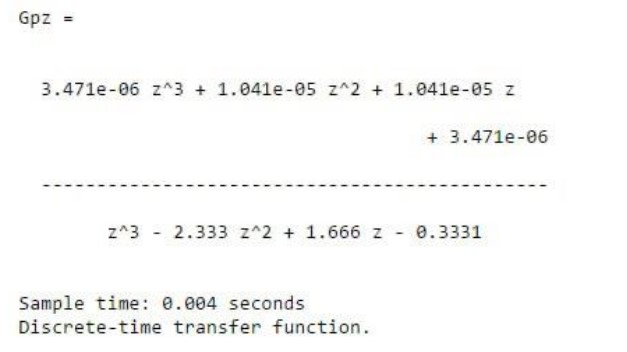

 

  

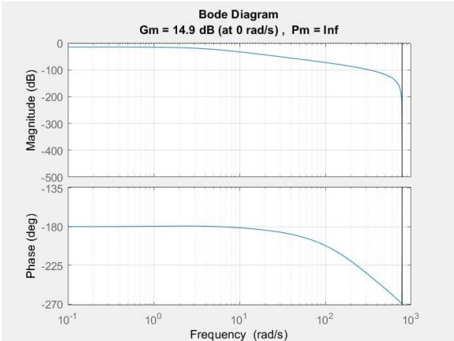

 

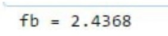

 

 

__Discrete Controller__:

 
 
We design a discrete controller that has similiar parameters to the analog one
 

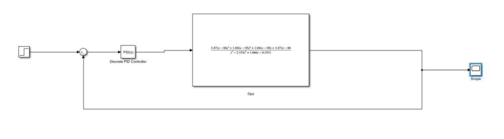

 

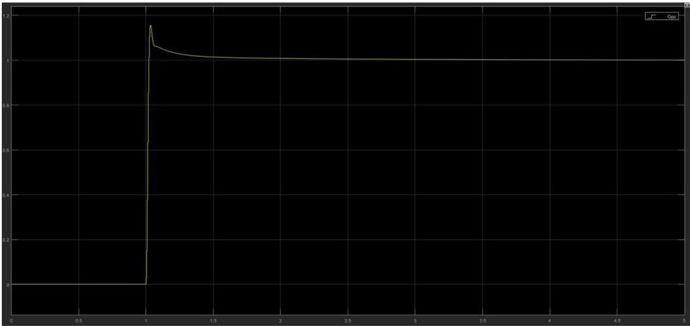

  

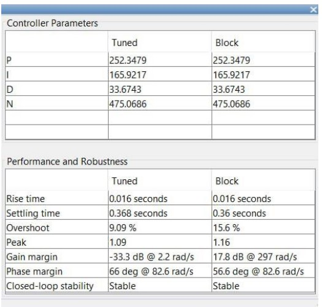

 
We check the performance of the controller on the non linear system
 

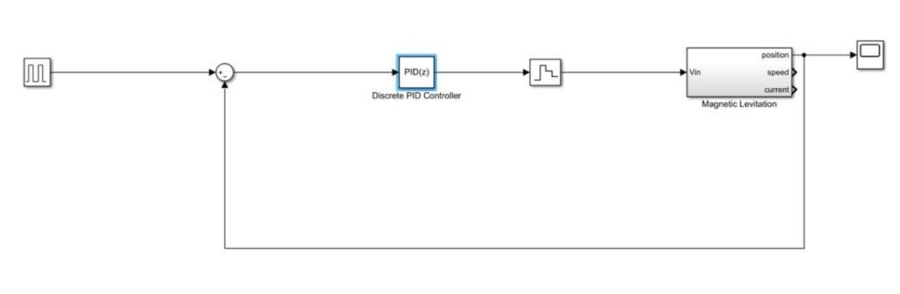

 

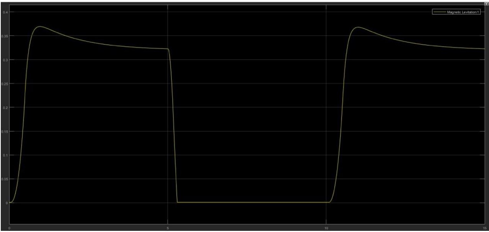
 

Now we plot the bode and rootlocus diagrams of the controlled system:
 
transfer function of the controller:
 
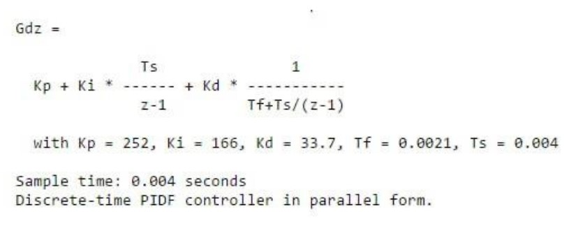
 
transfer function of the controlled system:
 
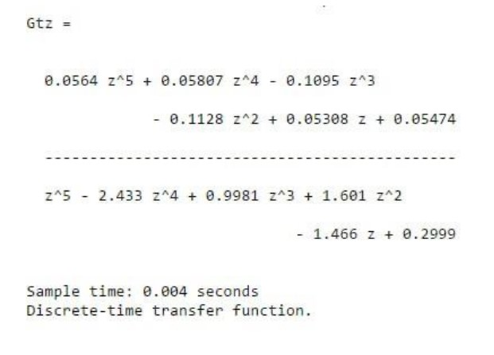
 
 
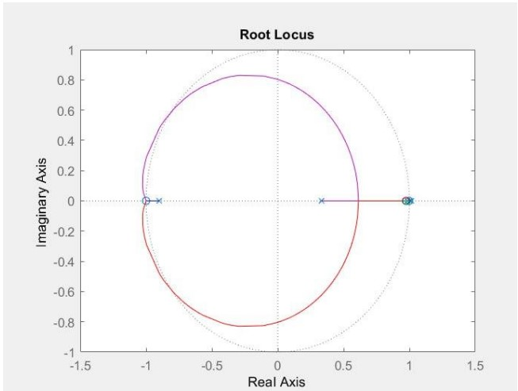
 
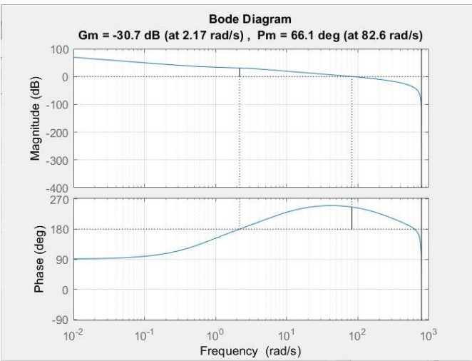
 
 
 

__deadbeat Controller__:
 
Now we design a deadbit controller for the system:
 
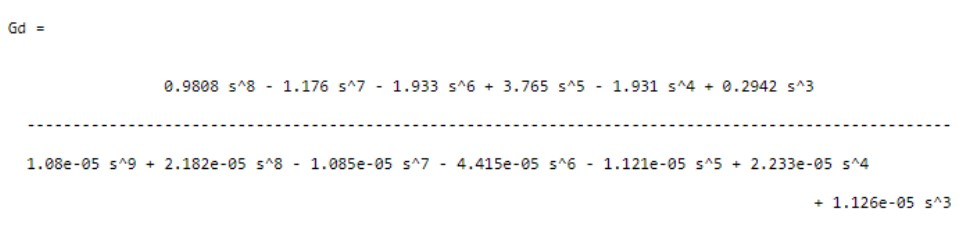
  
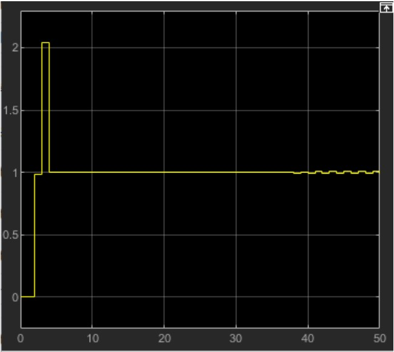
  

 
 

__Disturbance__:
 
We add white noise as disturbance to check the performance of the analog, digital and deadbeat controllers:
 
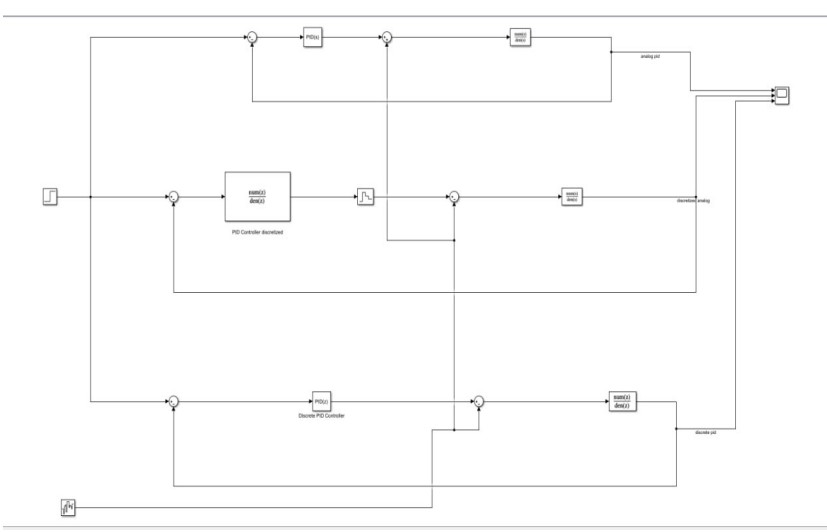
  
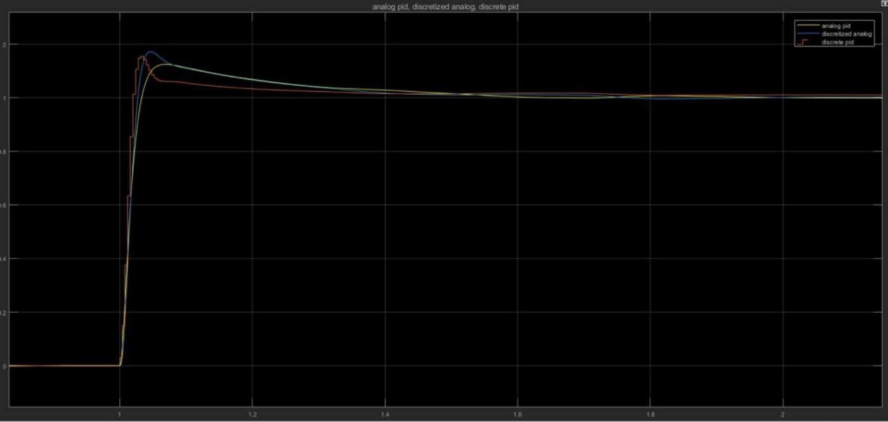
  
 

__Controllability & Observability__:
 
We want to find the controllability & observability of the discrete system. first we discretisize the state matrices. then we calculate the controllability and observability matrices.
 
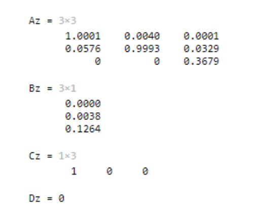
 
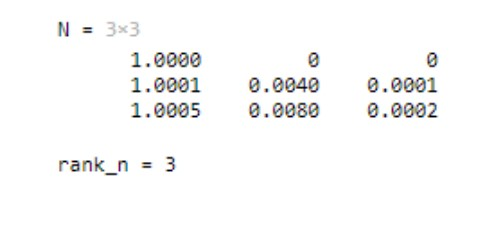
 
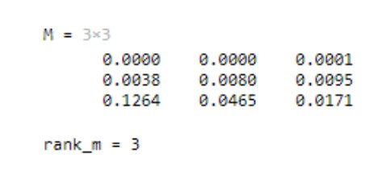
 
both matrices are full-rank so the system is controllable and observable.
 
 

__Full state feedback Controller__:
 
We want to design a feedback controller that has the same result as the deadbeat controller. In the deadbeat contrller: z^n=0. so we choose the desired poles as 0.
 
we use the ackermann method to find the desired feedback. we also use a gian in the system to adjust the output amplitude.
 

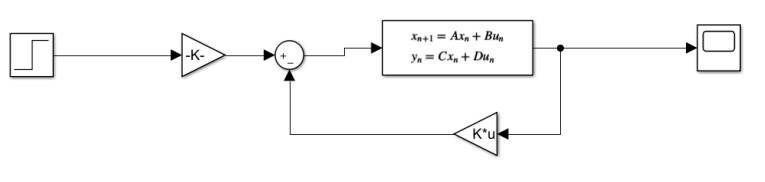
 
Iron Ball Height:
 
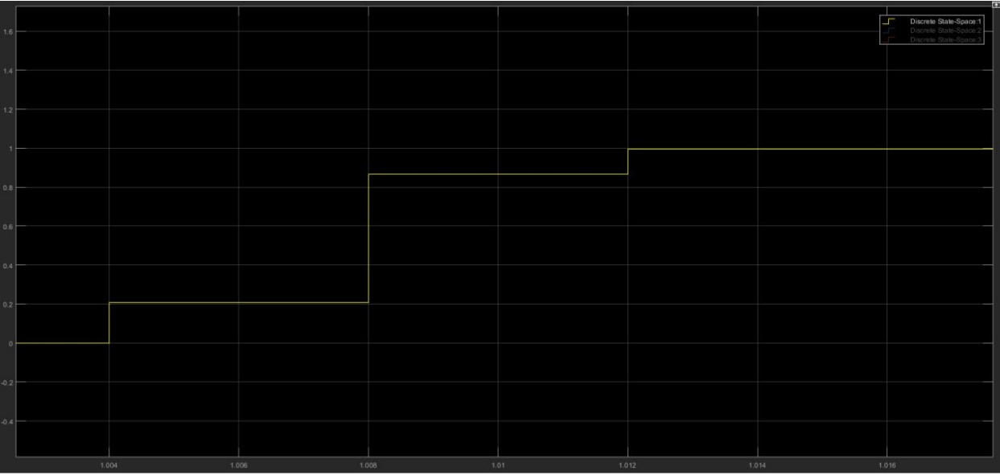
 
Iron Ball Speed:
 
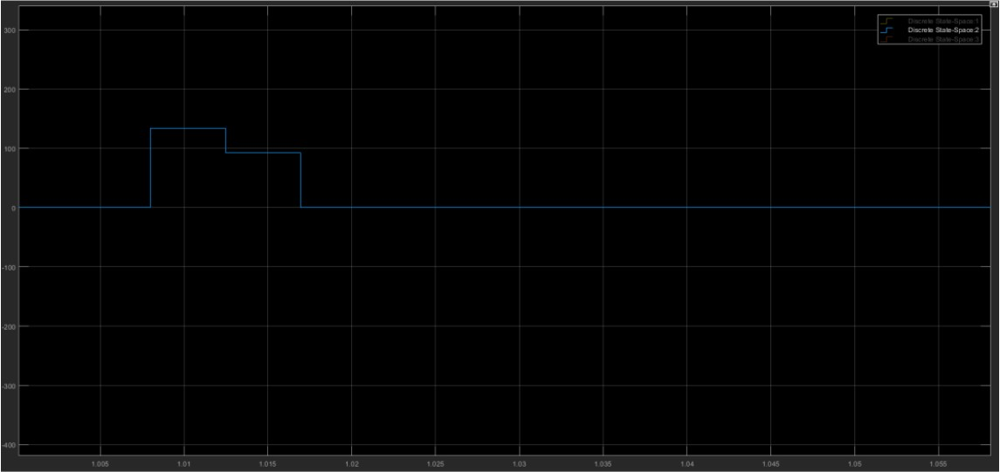
 
Current:
 
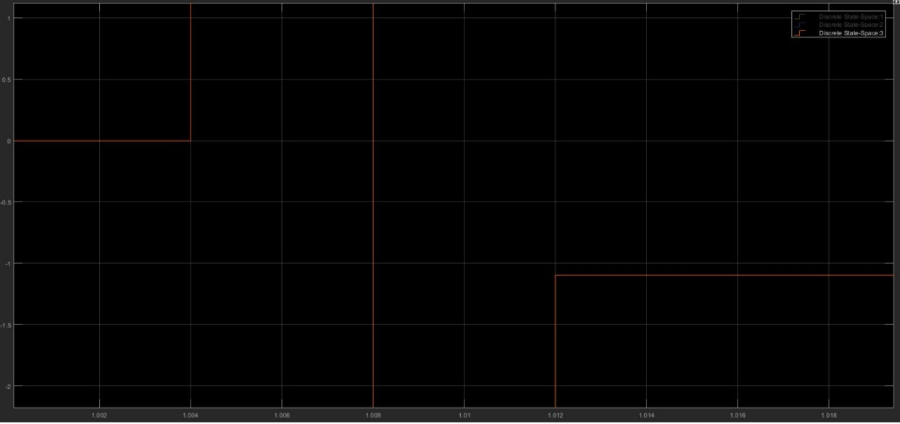
 
We also simulate the controller for the non-linear system:
 
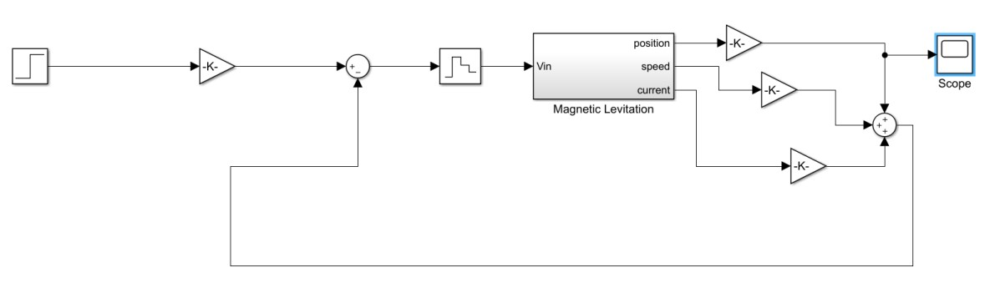
 
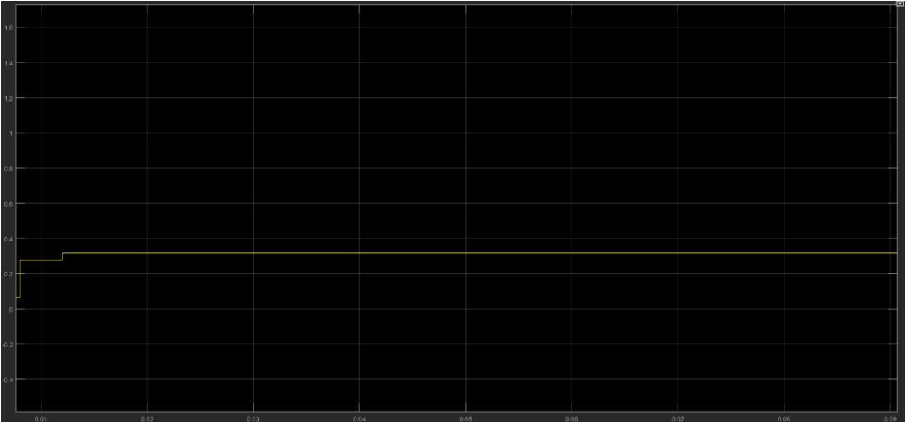
 
 
__State observer__:
 
We use the duality between controller and observer to design the observer. We choose the polse of the observer so that it would be fster. then we simulate the observer.
 

 

 

 

 
As we can see the desired output was achieved and the observer worked well.

