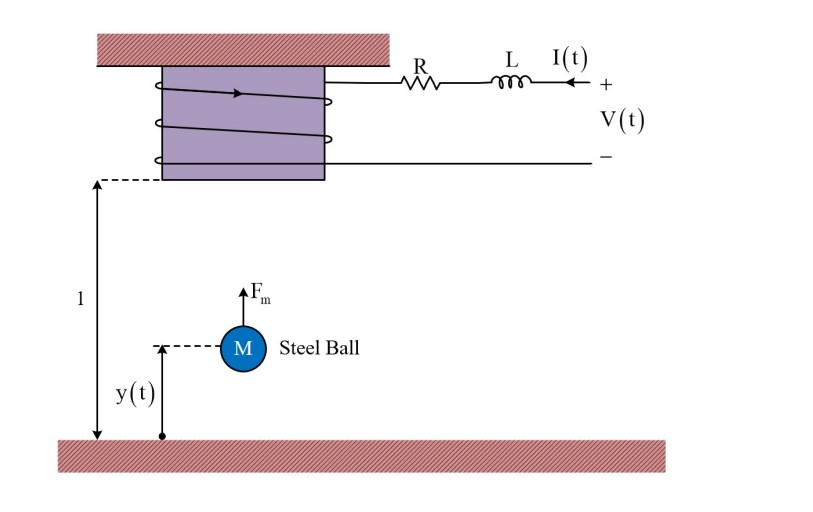
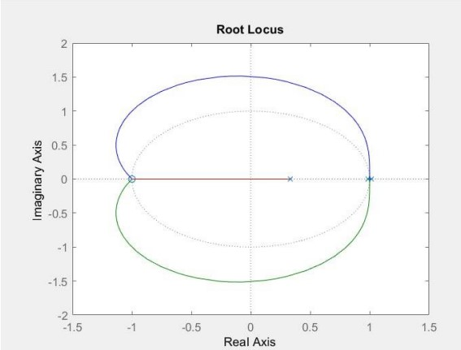

# Magnetic-Levitation-System-Control
 
Magnetic levitation enables gravity defying by applying magnetic fields to suspend objects in mid-air. This occurs as the magnetic force generated counteracts gravity, resulting in the object's suspension. An application of this is evident in Maglev trains, which glide almost frictionlessly above the track surface due to the absence of physical contact. Consequently, these trains can attain remarkable speeds. The operational mechanism involves altering the magnetic polarity along the rails to propel the train forward or backward.
 
 

__System Description__:
 
In the system below, there is a coil around the magnetic core and an iron ball. By applying a voltage to the coil and passing current, It attracts an iron ball from it. The purpose of this system is to control the height of the iron ball by the input voltage. In this system, y distance of the iron ball from the magnetic core, V  is the applied voltage to the system and I is the circuit current.

 

 
Here is the equations describing the system:
 

 
After finding the equilibrium point of the system and linearizing the system around that point, we calculate the state matrices:
 

 

__Controller__:
 
We design an analog PID controller for the system:
 

 

 

 

 
 
Then we xheck the controller performance in the non-linear system.
 

 

 

__System Discretization__:

 
Now we discretize the system
 

 

 

 

 

 
 
